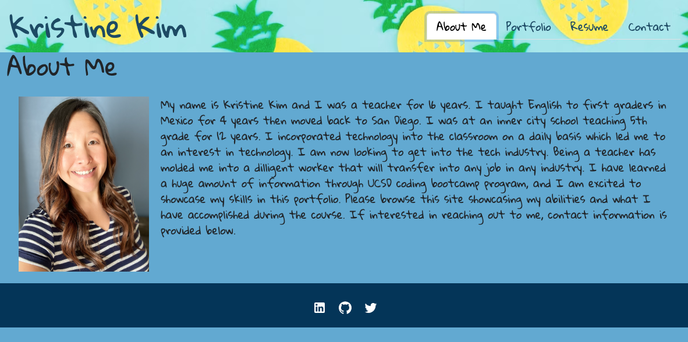

# Kristine Kim's React Portfolio
> This is my portfolio showcasing my skills and talents during the bootcamp program.  Through this portfolio, you will be able to see the progress I have made while highlighting my strongest work.
> Live demo [_here_](https://super-buttercream-4cf897.netlify.app/). <!-- If you have the project hosted somewhere, include the link here. -->

## Table of Contents
* [General Info](#general-information)
* [Technologies Used](#technologies-used)
* [Features](#features)
* [Screenshots](#screenshots)
* [Setup](#setup)
* [Project Status](#project-status)
* [Room for Improvement](#room-for-improvement)
* [Acknowledgements](#acknowledgements)
* [Contact](#contact)
<!-- * [License](#license) -->

## General Information
I created this to have a portfolio showcasing all the projects I made encompassing everything that I have learned during this bootcamp.  My goal is to make it into the educational tech industry since I was a teacher and have a lot of background information and knowledge in that area.
<!-- You don't have to answer all the questions - just the ones relevant to your project. -->

## Technologies Used
- React
- Vite
- Bootstrap
- Material UI

## Features
- Header with my name and navigation with titles corresponding to different sections of the portfolio.
- Portfolio section contains clickable links to the deployed application and to the GitHub repo
- Contact section contains a form to contact me directly.
- Resume section has a clickable link to a pdf of my resume and a list highlighting my skills.
- Clickable LinkedIn, GitHub, and Twitter icons in the footer.

## Screenshots

<!-- If you have screenshots you'd like to share, include them here. -->

## Setup.
In order to set up this app, enter `npm i` then `npm run dev` in the terminal.

## Project Status
Project is: _in progress_.

## Room for Improvement
Include areas you believe need improvement / could be improved. Also add TODOs for future development.

Room for improvement:
- Improve mobile first design
- Improve styling in portfolio section.

To do:
- Add next project deployed app and GitHub repo to portfolio section
- Add animations from a React animation library.
- Add functionality to contact section.

## Acknowledgements
- Many thanks to my instuctor, Michael Pacheco, the TAs, Nirav Venkatesan and Julius Dorfman, tutor, Anastasia Warren, and all of the learning assistants from AskBCS. 

## Contact
Created by Kristine Kim - feel free to email me at kristinehkim@gmail.com!

<!-- Optional -->
<!-- ## License -->
<!-- This project is open source and available under the [... License](). -->

<!-- You don't have to include all sections - just the one's relevant to your project -->

# React + Vite

This template provides a minimal setup to get React working in Vite with HMR and some ESLint rules.

Currently, two official plugins are available:

- [@vitejs/plugin-react](https://github.com/vitejs/vite-plugin-react/blob/main/packages/plugin-react/README.md) uses [Babel](https://babeljs.io/) for Fast Refresh
- [@vitejs/plugin-react-swc](https://github.com/vitejs/vite-plugin-react-swc) uses [SWC](https://swc.rs/) for Fast Refresh
